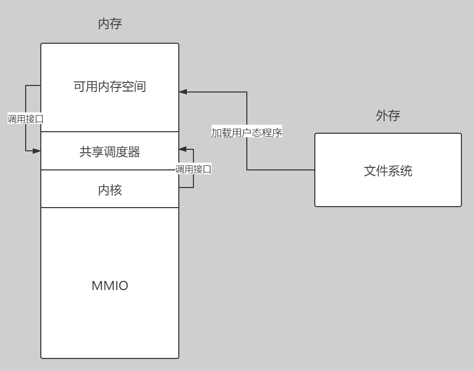

# 飓风内核（开发中）
异步内核就像风一样快！
飓风内核是运用共享调度器的异步内核。运行内核请参考“[如何运行](#如何运行)”章节。

## 基于共享调度器的异步内核设计
操作系统内核经历了几个主要的发展阶段，从裸机应用，批处理系统到多道任务系统，演变为至今主流的线程操作系统。这种系统基于线程的切换来调度任务；为了进一步提升性能，一些现代编程语言在应用层复用线程资源，提出了“协程”的概念，节省任务调度的开销。  
在本项目中我们提出一种新的内核开发思路：由不同资源共享调度器，在操作系统层面提供协程。我们希望这种全新设计的内核在满足传统内核的易用性的同时，拥有着专有内核的高性能特点，“像风一样快”，因此取名**飓风内核**——**tornado-os**。  
设计文档请参考[这里](https://qf.rs/2021/04/23/%E5%BC%82%E6%AD%A5%E5%86%85%E6%A0%B8%E7%9A%84%E8%AE%BE%E8%AE%A1%E4%B8%8E%E5%AE%9E%E7%8E%B0.html)  
同时这里有开发成员制作的[PPT](doc/shared_scheduler_based_async_kernel_design.pdf)

## 运行异步任务
飓风内核中和传统内核最大的不同点就在于多任务的运行方式，在飓风内核中基于共享调度器来运行异步任务，伪代码呈现如下：    
```Rust
pub extern "C" fn kernel_main() {
    // 内核的一些初始化过程
    kernel::init();
    // 共享调度器的基地址
    let base = 0x8600_0000;
    // 获取共享调度器
    let shared_scheduler = unsafe { task::SharedScheduler::load(base) };
    // 创建一个 Future
    let future = MyFuture::new();
    // 用 future 创建一个任务
    let task = task::KernelTask::new(future);
    // 往共享调度器里面添加任务
    shared_scheduler.add_task(task);
    // 内核异步运行时中的执行器执行任务
    runtime::executor::run_until_idle();
}

```

用户态运行异步任务的方法和内核态基本一致。  

## 系统架构
   

## 如何运行

如果您已经能够运行rCore-Tutorial，那么您的环境已经能满足编译飓风内核的要求，不需要再次安装构建工具，请直接开始下一步。

首先需要准备构建工具：  
+ Rust 环境(nightly-2021-03-01或以上)
+ [cargo-binutils](https://github.com/rust-embedded/cargo-binutils)
+ [qemu-system-riscv64](https://github.com/qemu/qemu)(建议使用 5.2.0 版本)

下载源码：  
```bash
git clone git@github.com:HUST-OS/tornado-os.git
```

快速运行：  
```bash
cd tornado-os
cargo mkfs
cargo qemu
```

其中，cargo mkfs将生成文件的镜像，它需要在Linux或macOS系统下运行；如果开发环境是Windows，可以考虑在WSL下开发项目。
cargo qemu能在任何的操作系统下运行。

项目直接使用xtask写法，所以不需要安装make、just等脚本工具。如果在编写的过程中要求输入账号密码，可能因为xtask写法而输入失败。
这时候需要修改[xtask/src/main.rs](./xtask/src/main.rs)文件中的 `PASSWORD` 全局变量。
也可以使用`sudo su`等需要特权的Linux命令，输入密码后退出`su`环境，当前控制台暂时保存权限，此时再运行命令就不需要输入密码了。


如果需要调试功能，请安装调试工具链 `riscv64-linux-gnu-objdump`，该工具在 Ubuntu 操作系统上可以通过 `apt-get` 下载。  
调试工具：RISC-V 指令集支持的 [gdb](https://mirrors.tuna.tsinghua.edu.cn/gnu/gdb/?C=M&O=D)  

## 进度
+ 内核开发基础设施(内存管理，页表机制，中断处理等)已经基本完成
+ 共享调度器的设计与实现已经完成，将来或许会有些改动，但总体实现思路已经比较成熟
+ 内核态和用户态的异步运行时的实现初步完成，由于 Rust 语言异步运行时的灵活性，将来可能有较为频繁的改动
+ 异步版的 [virtio 块设备驱动](./async-virtio-driver)已经完成
+ 不同地址空间之间任务的切换已经实现
+ 异步块设备读写系统调用已经实现

## 源码阅读小助手
该项目主要由如下几个子项目组成：  
+ tornado-kernel: 飓风内核实现
+ shared-scheduler: 共享调度器实现
+ tornado-user: 用户态代码实现
+ async-virtio-driver: 异步virtio块设备驱动
+ async-fat32: 异步fat32文件系统
+ async-mutex: 异步锁
+ async-sd: 异步sd卡驱动
+ event: 事件机制库`no_std`支持
+ rv-lock: RISC-V指令集关中断的锁

其中共享调度器以二进制包的形式编译，集成一些接口提供给内核和用户，具体实现参考[代码](shared-scheduler/src/main.rs)。  
飓风内核中与共享调度器通过 API 兼容方式进行交互，具体参考[代码](tornado-kernel/src/task/shared.rs)，用户态代码同上，具体请参考[代码](tornado-user/src/task/shared.rs)。  
内核态和用户态都分别实现了一个`执行器`，分别是[内核态执行器](tornado-kernel/src/task/executor.rs)和[用户态执行器](tornado-user/src/task/shared.rs)。  
内核中任务的定义在[这里](tornado-kernel/src/task/kernel_task.rs)，用户态中任务的定义在[这里](tornado-user/src/task/user_task.rs)，不同的地址空间可以定义自己的任务语义，其他地址空间无法解析。  

## 开发文档
+ [无相之风战队官方网站](https://qf.rs/)
    - [异步内核的设计与实现](https://qf.rs/2021/04/23/%E5%BC%82%E6%AD%A5%E5%86%85%E6%A0%B8%E7%9A%84%E8%AE%BE%E8%AE%A1%E4%B8%8E%E5%AE%9E%E7%8E%B0.html)
    - [地址空间与进程](https://qf.rs/2021/05/01/%E5%9C%B0%E5%9D%80%E7%A9%BA%E9%97%B4%E4%B8%8E%E8%BF%9B%E7%A8%8B.html)
    - [执行器与生成语义](https://qf.rs/2021/05/01/%E6%89%A7%E8%A1%8C%E5%99%A8%E4%B8%8E%E7%94%9F%E6%88%90%E8%AF%AD%E4%B9%89.html)
    - [异步virtio之块设备驱动实现](https://qf.rs/2021/05/26/%E5%BC%82%E6%AD%A5%E7%89%88virtio%E5%9D%97%E8%AE%BE%E5%A4%87%E9%A9%B1%E5%8A%A8%E5%AE%9E%E7%8E%B0.html)
+ [doc](doc)目录
+ 代码注释，项目代码中有着充分的文档注释，包括一些实现思路

## 衍生项目
项目开发过程中，我们经常会有一些想法和思路，在完整的项目中不是很好实现，因此衍生出一些其他的项目：  
+ [洛佳的异步内核实验室](https://github.com/HUST-OS/luojia-os-labs)
+ [洛佳的异步内核实验室第二版](https://github.com/HUST-OS/luojia-os-labs-v2)
+ [异步virtio块设备驱动](https://github.com/HUST-OS/async-virtio-driver)

其中，`洛佳的异步内核实验室`中实现了一个**内核中的生成器语法**，非常有研究价值，欢迎访问博客[执行器与生成语义](https://qf.rs/2021/05/01/%E6%89%A7%E8%A1%8C%E5%99%A8%E4%B8%8E%E7%94%9F%E6%88%90%E8%AF%AD%E4%B9%89.html)  
另外，我们还初步实现了一款基于 Rust 语言异步语法的 virtio 块设备驱动库，并可以结合本项目以异步的方式运行块设备读写任务，详细内容请访问博客[异步版VIRTIO之块设备驱动实现](https://qf.rs/2021/05/26/%E5%BC%82%E6%AD%A5%E7%89%88virtio%E5%9D%97%E8%AE%BE%E5%A4%87%E9%A9%B1%E5%8A%A8%E5%AE%9E%E7%8E%B0.html)  

## TODO
+ 从内核层面提供异步网络 IO(异步网络协议栈)
+ 性能测试分析
+ 活用内核生成器语法
