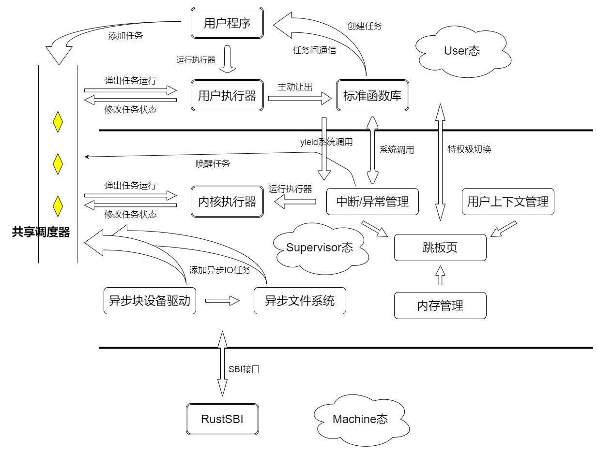
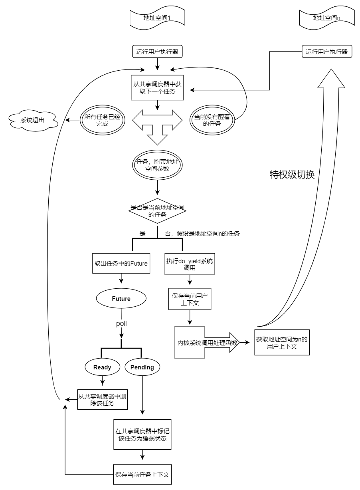

# 飓风内核（开发中）
异步内核就像风一样快！  


## 基于共享调度器的异步内核设计
操作系统内核经历了几个主要的发展阶段，从裸机应用，批处理系统到多道任务系统，演变为至今主流的线程操作系统。这种系统基于线程的切换来调度任务；为了进一步提升性能，一些现代编程语言在应用层复用线程资源，提出了`协程`的概念，旨在节省任务调度的开销。  
在本项目中我们提出一种新的内核开发思路：由不同资源共享调度器，在操作系统层面提供协程。我们希望这种全新设计的内核在满足传统内核的易用性的同时，拥有着专有内核的高性能特点，“像风一样快”，因此取名**飓风内核**——**tornado-os**。  

## 运行异步任务
飓风内核中和传统内核最大的不同点就在于多任务的运行方式，在飓风内核中基于共享调度器来运行异步任务，伪代码呈现如下：    
```Rust
pub extern "C" fn kernel_main() {
    // 内核的一些初始化过程
    kernel::init();
    // 共享调度器的基地址
    let base = 0x8600_0000;
    // 获取共享调度器
    let shared_scheduler = unsafe { task::SharedScheduler::load(base) };
    // 创建一个 Future
    let future = MyFuture::new();
    // 用 future 创建一个任务
    let task = task::KernelTask::new(future);
    // 往共享调度器里面添加任务
    shared_scheduler.add_task(task);
    // 内核异步运行时中的执行器执行任务
    runtime::executor::run_until_idle();
}

```

用户态运行异步任务的方法和内核态基本一致。  

## 系统架构
  


## 如何执行异步任务
  


## 如何运行

如果您已经能够运行[rCore-Tutorial](https://github.com/rcore-os/rCore-Tutorial-v3)，那么您的环境已经能满足编译飓风内核的要求，不需要再次安装构建工具，请直接开始下一步。

首先需要准备构建工具：  
* Rust 环境(nightly-2021-03-01或以上)
* [qemu-system-riscv64](https://github.com/qemu/qemu)(请使用 5.2.0 版本)
* `riscv64-linux-gnu-`系列或`riscv64-unknown-elf-`系列两种常用的RISC-V工具链，或Rust嵌入式社区的[cargo-binutils](https://github.com/rust-embedded/cargo-binutils)工具链
* 调试工具(可选)：RISC-V 指令集支持的 [gdb](https://mirrors.tuna.tsinghua.edu.cn/gnu/gdb/?C=M&O=D)

下载源码：  
```bash
git clone https://github.com/HUST-OS/tornado-os.git
```

在qemu上运行：  
```bash
cd tornado-os
cargo mkfs # 生成文件镜像
cargo qemu # 运行qemu模拟器
```

其中，cargo mkfs将生成文件的镜像，它需要在Linux或macOS系统下运行；如果开发环境是Windows，可以考虑在WSL下开发项目。
cargo qemu能在任何的操作系统下运行。

项目直接使用xtask写法，所以不需要安装make、just等脚本工具。如果在编写的过程中要求输入账号密码，可能因为xtask写法而输入失败。
这时候需要修改[xtask/src/main.rs](./xtask/src/main.rs)文件中的 `PASSWORD` 全局变量。
也可以使用`sudo su`等需要特权的Linux命令，输入密码后退出`su`环境，当前控制台暂时保存权限，此时再运行命令就不需要输入密码了。

在k210上运行：  
首先制作sd卡，将sd卡放入读卡器中，连接到PC端，确认您的sd卡分区，假设是`/dev/sdb`，然后运行以下命令：

```bash
cargo mkfs # 生成文件镜像
dd if=fs.img of=/dev/sdb count=1440k # 将文件镜像写入到sd卡中
```
然后将sd卡从读卡器中拔出来插入到k210板子上，将k210板子连接到PC端，运行以下命令：

```bash
cargo k210 # 将内核二进制文件烧写到k210中运行
```

note: k210模式下按`Ctrl + ]`退出。


## Features
|内核组件|状态|未来改动|
|---|---|---|
|内存管理|✅|小|
|中断管理|✅|小|
|跳板页切换|✅(特权级切换)|小|
|共享调度器|✅|较小|
|内核异步运行时|✅(执行器)|比较大|
|用户异步运行时|✅(执行器)|大|
|virtio异步块设备驱动|✅|小|
|sd卡异步驱动|✅(未完全)|待实现|
|virtio异步网卡驱动|❌|待实现|
|不同地址空间任务切换|✅(yield系统调用)|小|
|保底机制(时钟中断的处理)|❌|待实现|
|相同地址空间任务通信|✅(Channel)|较小|
|不同地址空间任务通信|❌|待实现|
|性能测试|❌|待实现|


|系统调用|状态|实现优先级|
|---|---|---|
|yield|✅|高|
|异步IO|✅(块设备读写)|高|
|异步文件IO|❌|较高|
|exec|❌|低|

## 目录介绍
|目录名称|介绍|
|---|---|
|tornado-kernel|飓风内核实现|
|shared-scheduler|共享调度器实现|
|tornado-user|用户态代码实现|
|async-virtio-driver|异步virtio块设备驱动|
|async-fat32|异步fat32文件系统|
|async-mutex|异步锁|
|async-sd|异步sd卡驱动|
|event|事件机制库`no_std`支持|
|rv-lock|RISC-V指令集关中断的锁|

其中共享调度器以二进制包的形式编译，集成一些接口提供给内核和用户，具体实现参考[代码](shared-scheduler/src/main.rs)。  
飓风内核中与共享调度器通过 API 兼容方式进行交互，具体参考[代码](tornado-kernel/src/task/shared.rs)，用户态代码同上，具体请参考[代码](tornado-user/src/task/shared.rs)。  

## 开发文档
+ [doc](doc)目录
    * [第一章-飓风内核设计](doc/第一章-飓风内核设计.md)
    * [第二章-共享调度器设计与实现](doc/第二章-共享调度器设计与实现.md)
    * [第三章-内核任务与内核执行器](doc/第三章-内核任务与内核执行器.md)
    * [第四章-用户执行器与yield系统调用](doc/第四章-用户执行器与yield系统调用.md)
    * [第五章-virtio异步块设备驱动](doc/第五章-virtio异步块设备驱动.md)
    * [第六章-异步fat32文件系统](doc/第六章-异步fat32文件系统.md)
+ 代码注释，项目代码中有着充分的文档注释，包括一些实现思路

## 衍生项目
项目开发过程中，我们经常会有一些想法和思路，在完整的项目中不是很好实现，因此衍生出一些其他的项目：  
+ [洛佳的异步内核实验室](https://github.com/HUST-OS/luojia-os-labs)
+ [洛佳的异步内核实验室第二版](https://github.com/HUST-OS/luojia-os-labs-v2)
+ [异步virtio块设备驱动](https://github.com/HUST-OS/async-virtio-driver)

其中，`洛佳的异步内核实验室`中实现了一个**内核中的生成器语法**，非常有研究价值，欢迎访问博客[执行器与生成语义](https://qf.rs/2021/05/01/%E6%89%A7%E8%A1%8C%E5%99%A8%E4%B8%8E%E7%94%9F%E6%88%90%E8%AF%AD%E4%B9%89.html)  

## TODO
+ 从内核层面提供异步网络IO(异步网络协议栈)
+ 性能测试分析
+ 活用内核生成器语法
+ 多核环境下的上下文管理机制

## 开源协议
本项目使用双开源协议：  
* [木兰许可证](./LICENSE-MULAN)
* [Apache](./LICENSE-Apache)

## **无相之风战队出品**
欢迎浏览[无相之风战队官方网站](https://qf.rs/)！

