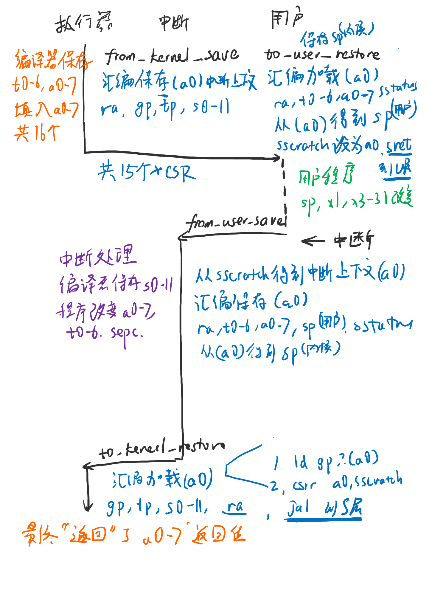

# 执行器与生成语义

操作系统为处理多应用而生，应当包含执行应用、中断处理这些模块。
传统的方法需要较多不会返回的函数，某种程度上，需要开发者加以更多的注意。
我们基于逐渐成型的“生成器语义”，提出一种新的方法来编写它们。

要搭建生成器语义的执行器，我们使用一个“恢复”函数运行用户应用，“恢复”函数将返回产生的中断；
这样可以以一种编程语言常见的形式，来隐含切换到应用和处理中断的流程。另外，应用切换到内核也可使用相似的形式。
这种方法能包装了应用执行和中断处理的逻辑，降低了编写难度，增加内核开发者的编程效率。

## 1 生成器与“让出”操作

以Rust语言为例，我们来看“生成器”是如何的一种概念。生成器存在特殊的“让出”操作，允许在运行“让出”操作时，
打断当前的执行流程，回到调用生成器的环境。“让出”操作可以带一个返回值，允许环境做一些需要的操作。

我们看一段例子代码（[来源：知乎@MashPlant](https://zhuanlan.zhihu.com/p/157496421)）：

```rust
use std::ops::{Generator, GeneratorState};
use std::pin::Pin;

fn main() {
    let mut g = || {
        yield 1;
        return "foo"
    };  

    assert_eq!(Pin::new(&mut g).resume(()), GeneratorState::Yielded(1));
    assert_eq!(Pin::new(&mut g).resume(()), GeneratorState::Complete("foo"));
}
```

这里的变量“g”定义比较像普通的闭包，但里面出现了“yield”让出关键字，所以变量“g”变成了一个生成器。
生成器拥有一个“恢复”即“resume”函数，只要调用了恢复函数，生成器就会继续执行，直到下一个“让出”操作或者“返回”。

出现“让出”操作时，生成器内的代码将会暂停运行，让出到它的调用者即“main”函数，它将拿到让出操作的让出值。
使用让出值执行一些操作，可以打印出来，或者也可以做一些随后的处理，这里判断它和预期的值是否相等。
这之后，可以继续执行“恢复”函数，直到生成器运行结束。

所以简单来说，生成器是一个执行可以暂停，并不断产生值的一种变量。拥有一个生成器时，我们可以不断执行它，
处理它产生的中间值，直到它的执行过程完成。

## 2 内核执行器的新编程方法

传统内核中隐约地包含了“执行器”的思想：它运行当前的线程，中断发生时暂停线程，转入调度程序，得到下一个要运行的线程。
编写传统内核的调度逻辑，开发者必须完整地了解上下文切换、中断处理的流程。

思考内核的编写方法。应用的执行可以暂停，它可以不断地产生中断的原因和上下文。咦，这是不是和生成器的思路非常相似？

于是，我们可以把内核的运行环境看作是一个生成器。内核不断执行“恢复”函数，继续运行用户代码。
每当中断发生，将会产生中断的原因和上下文，这就是生成器生成的让出值。
内核前去处理让出值，在这期间，可以决定下一个要运行的应用，切换继续运行的应用，继续“恢复”它们，直到应用执行完成。

在传统内核中，假设运行环境是一个产生中断的生成器，我们可以编写下面的伪代码：

```rust
let mut runtime = Runtime::new(); // Runtime是一个生成器，实现了trait Generator
runtime.prepare_first_thread();
loop { // 不断执行恢复操作
    match Pin::new(&mut runtime).resume(()) { // 判断产生的中断是哪种类型
        Yielded(ResumeResult::Syscall()) => {
            syscall_process(&mut runtime); 
            // runtime包含用户上下文，系统调用函数会读取其中的参数，将返回值填写回runtime里。
            // 随后，下一个循环resume函数会继续执行当前的线程
            // 如果这个系统调用将增加一个线程，它会操作runtime的值。
        }
        Yielded(ResumeResult::TimerInterrupt()) => {
            runtime.prepare_next_thread();
            // 准备完毕后，下一个循环的resume函数将会执行下一个线程
        }
        Yielded(ResumeResult::IllegalInstruction(_insn_addr)) => {
            core_dump();
            runtime.destroy_current_thread();
            runtime.prepare_next_thread();
            // 当前的线程会被销毁，然后下一个线程会在下一个resume函数被运行
        }
        Complete(()) => break // 如果没有线程了，执行器运行结束
    }
}
```

这样的编程方法遵守了高级语言的思路。在Rust语言中，它没有使用全局变量，便于控制生命周期，
能提高开发者的编程效率和代码的安全性。只要在启动代码最后使用这段代码，就可以不断运行线程了。

接下来就是生成器要如何实现了。和普通应用的生成器不同，内核的中断和恢复是比较复杂的。
我们需要整理传统的上下文切换方法，实现内核运行用户的生成器。

## 3 实现生成器

对不同的架构来说，传统内核的上下文切换，需要保存和读取通用的寄存器，也需要地址空间的切换操作。
不同的是，当前执行器的上下文将将被保存，因为后续仍然需要运行执行器。

以常用于嵌入式开发的RTOS为例，我们需要存取通用的寄存器。
在恢复函数执行时，首先保存当前执行器的上下文，只需要保存被调用者保存的寄存器，因为调用者保存的寄存器已经在调用函数之前保存了。
在RISC-V中，需要保存所有的s0-s11寄存器。因为用户程序不会为我们保存返回地址，所以我们还需要保存ra寄存器。

然后，恢复用户的上下文，这里应当保存用户所有的寄存器。
在RISC-V架构中，需要x1一直到x31寄存器；如果内核也可能发生中断，为了支持嵌套中断，还需要保存sstatus寄存器。

用户和内核都可能修改gp、tp寄存器。为了隔离数据、增加安全性，两个过程都需要保存gp、tp寄存器。

产生中断时，首先保存用户的上下文，随后跳转到中断处理函数。中断处理函数将保存s0-s11寄存器，返回值保存到a0和a1寄存器。
最后，当中断处理函数返回，它将跳转到另一段代码，它将恢复内核的ra、s0-s11寄存器，最终通过ra寄存器，返回到内核的生成器中。

这个生成器绕了一圈，终于接收到了中断处理函数传来的a0和a1寄存器作为返回值，说明收到了中断。
生成器的函数终于可以返回了，它将返回到运行它的执行环境中，以等待下一步的操作。

我们用伪代码来说明这个过程：

```rust
impl Generator for Runtime {
    type Yield = IsaSpecificTrap;
    type Return = ();
    fn resume(mut self: Pin<&mut Self>, _arg: ()) -> GeneratorState<IsaSpecificTrap, ()> {
        do_resume(&mut self.context);
        // 到这里，用户程序已经开始执行。发生中断时，跳转到处理函数interrupt。
        // ← 当interrupt_return函数运行结束，它将返回到这里
        return IsaSpecificCauseRegister::read().into()
    }
}
fn do_resume(ctx: &mut UserContext) {
    asm!("save executor context", "load user context `ctx`", "jump to user application")
}
fn interrupt() -> ! { 
    asm!("save user context", "jump to `interrupt_return`")
}
fn interrupt_return() -> ! {
    asm!("load executor context", "jump to return address register") 
    // 这段代码已经完成了中断上下文的操作，它会返回到resume函数中 →
}
```

可以看到，恢复函数跳转到了用户程序中。但是，中断处理函数给恢复函数填写了返回值。
从用户看来，虽然经过很多过程的包装，但生成器函数竟然能够返回，拿到中断的类型和上下文。
至此，最重要的恢复操作已经实现，生成器可以投入使用了。

这段代码是伪代码，具体能运行的实现代码已经提交到luojia-os-labs中：[生成器](https://github.com/HUST-OS/luojia-os-labs/blob/main/01b-magic-return-kern/kernel/src/executor.rs)、[使用方法](https://github.com/HUST-OS/luojia-os-labs/blob/b3876866f2b6e2b6ad7bd1eba286fbaa9a6cca8a/01b-magic-return-kern/kernel/src/main.rs#L37)。



需要做的一些说明是，具体实现中，参数的填写方式和二进制接口有关。如果返回值的长度超过两个usize长度，RISC-V下参数会从a1寄存器开始填写，
a0寄存器将被用作寄存器相对寻址，来保存真正的返回值；参数将不会a0寄存器开始保存。

根据中断处理函数的返回值类型，来决定上下文参数要放在a0还是a1中。一般为了简便，中断处理函数的返回值都很小，
就假设它很小，总是填在a0里面就可以了。如果写错了参数的保存方法，代码会出现很多意料之外的情况。

## 4 生成语义与“相对性”

经过以上的讨论，我们的内核可以创建一个生成器，不断执行它的恢复操作，运行所有的应用程序。我们有一个很大胆的想法。

首先我们来做一个思维实验。有一个人在地球上画一个圈，然后他站在圈里面。
如果从地球上其他人来看，是这个人被圈圈在里面。如果从这个人的角度看，是地球上的其他人都被圈在圈里面。

那么，如果内核能不断用生成器使用用户，用户能不能也把内核看成生成器，不断使用内核呢？

好像想得通啊，是不是有些头皮发麻了？不急，我们看看怎么回事。

每当发生一个硬件中断，它不是由内核产生的，也不是由用户产生的。
如果我们有一个不断运行任务的应用，把所有的任务看作是相对于内核的用户，它将运行所有的任务，不断产生“运行结束”的提示。
或者，如果一个任务超时了，将产生“已经超时”的提示。
如果是运行结束，用户的执行器可以复用原有的栈，拿出下一个任务，继续运行。
如果生成了“已经超时”，上一个任务的栈将会保留，执行器将创建一个新的栈，来运行下一个任务。

那么如何编写这个生成器呢？如果产生了中断，永远是内核在处理，轮不到用户去处理，于是用户没有机会知道中断发生了。
除非，用户层也有一个中断委托机制。即使内核能切换到其它的用户，如果内核在切换到这个用户时，提示用户，发生了一次上下文切换，
这时候用户就能包装这个提示，作为“已经超时”，作为生成器实现的一部分了。

如果在有信号量的系统，我们可以使用信号量，完成上下文切换提示的过程。如果硬件提供了用户层中断，我们也可以将它作为一个提示，
用生成语义实现用户层的执行器。

在这种比较初步的想法下，内核和用户都能接收到中断，他们是相对的。在未来的架构中，我们可以尝试使用生成语义，
在用户层更高效地开发的执行器和运行环境。

## 一些记录

Rust语言有一个还没稳定的执行器语法，我提了一个[issue评论](https://github.com/rust-lang/rust/issues/43122#issuecomment-830573558)，不知道社区的各位会怎么看。就记在这里，以免找不到issue。
