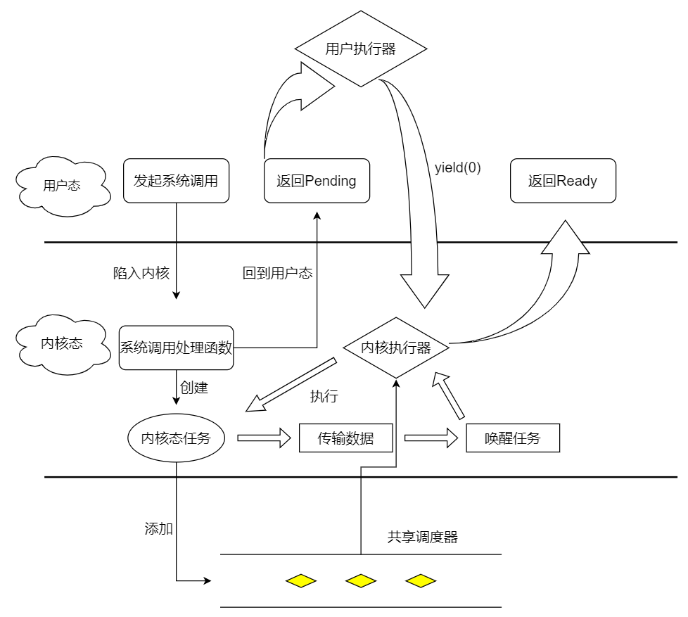

# 飓风内核中的异步IO系统调用
基于共享调度器和内核/用户异步运行时，实现面向用户态的异步IO系统调用接口。

## 什么是异步IO系统调用
从用户态角度看，用户程序是通过IO相关的系统调用来实现与外设的数据传输的。

> 下面段落摘自[rCore教程](https://rcore-os.github.io/rCore-Tutorial-Book-v3/chapter8/1io-interface.html)

在UNIX环境中IO系统调用有多种不同类型的执行模型，根据Richard Stevens的经典书籍“UNIX Network Programming Volume 1: The Sockets Networking ”的6.2节“I/O Models ”的介绍，大致可以分为五种I/O执行模型：  
* blocking IO
* nonblocking IO
* IO multiplexing
* signal driven IO
* asynchronous IO

阻塞IO(blocking IO):  
1. 用户进程发出`read`系统调用
2. 内核发现所需数据没在I/O缓冲区中，需要向磁盘驱动程序发出I/O操作，并让用户进程处于阻塞状态
3. 磁盘驱动程序把数据从磁盘传到I/O缓冲区后，通知内核（一般通过中断机制），内核会把数据从I/O缓冲区拷贝到用户进程的buffer中，并唤醒用户进程（即用户进程处于就绪态）
4. 内核从内核态返回到用户态的用户态进程，此时read系统调用完成

非阻塞IO(non-blocking IO):  
1. 用户进程发出`read`系统调用
2. 内核发现所需数据没在I/O缓冲区中，需要向磁盘驱动程序发出I/O操作，并不会让用户进程处于阻塞状态，而是立刻返回一个error
3. 用户进程判断结果是一个error时，它就知道数据还没有准备好，于是它可以再次发送read操作（这一步操作可以重复多次）
4. 磁盘驱动程序把数据从磁盘传到I/O缓冲区后，通知内核（一般通过中断机制），内核在收到通知且再次收到了用户进程的system call后，会马上把数据从I/O缓冲区拷贝到用户进程的buffer中
5. 内核从内核态返回到用户态的用户态进程，此时read系统调用完成

多路复用IO(IO multiplexing):  
IO multiplexing对应的I/O系统调用是select和epoll等，也称这种IO方式为事件驱动IO(event driven IO)。 select和epoll的优势在于，采用单进程方式就可以同时处理多个文件或网络连接的I/O操作。其基本工作机制就是通过select或epoll系统调用来不断的轮询用户进程关注的所有文件句柄或socket，当某个文件句柄或socket有数据到达了，select或epoll系统调用就会返回到用户进程，用户进程再调用read系统调用，让内核将数据从内核的I/O缓冲区拷贝到用户进程的buffer中。

信号驱动(signal driven IO):  
当进程发出一个read系统调用时，会向内核注册一个信号处理函数，然后系统调用返回，进程不会被阻塞，而是继续执行。当内核中的IO数据就绪时，会发送一个信号给进程，进程便在信号处理函数中调用IO读取数据。此模型的特点是，采用了回调机制，这样开发和调试应用的难度加大。

**异步IO(asynchronous IO)**
用户进程发起`read`系统调用之后，立刻就可以开始去做其他的事。而另一方面，从内核的角度看，当它收到一个`read`系统调用之后，首先它会立刻返回，所以不会对用户进程产生任务阻塞的情况，然后内核会等待数据准备完成，然后将数据拷贝到用户内存，当这一切都完成之后，内核会通知用户进程，告诉它`read`操作完成了。

## 飓风内核中异步IO系统调用的实现
在阅读本章节之前，请确保自己对飓风内核中`共享调度器`，`任务`，`内核执行器`，`用户执行器`，`yield系统调用`等概念有一定的理解，相关文档章节如下：  
* [第二章-共享调度器设计与实现](doc/第二章-共享调度器设计与实现.md)
* [第三章-内核任务与内核执行器](doc/第三章-内核任务与内核执行器.md)
* [第四章-用户执行器与yield系统调用](doc/第四章-用户执行器与yield系统调用.md)

飓风内核中异步IO系统调用的实现思路是：  
1. 首先用户发起IO系统调用(假设该用户地址空间为1)
2. 陷入内核，进入系统调用处理函数
3. 创建一个内核任务，添加到共享调度器
4. 该任务执行两步操作：一是调用异步块设备驱动接口将数据搬运到用户提供的缓冲区，二是唤醒发起该系统调用的任务
5. 回到用户态，该任务返回`Pending`
6. 用户执行器继续执行
7. 当用户执行器从共享调度器中返回`ShouldYield(0)`的时候，切换到内核地址空间中去执行内核态任务
8. 当上面第3步创建的任务执行完毕的时候，发起异步IO系统调用的任务也就完成了
9. 内核或者用户执行器继续执行
10. 当内核/用户执行器从共享调度器中返回`ShouldYield(1)`的时候，切换回原来发起异步IO系统调用的任务中继续执行，这时候异步任务返回`Ready`
11. 用户执行器继续从共享调度器中取出下一个任务去执行
12. ......
13. 共享调度器中所有任务执行完成，系统退出

代码实现请参考[user_syscall.rs](../tornado-kernel/src/syscall/user_syscall.rs)

## 流程图
  