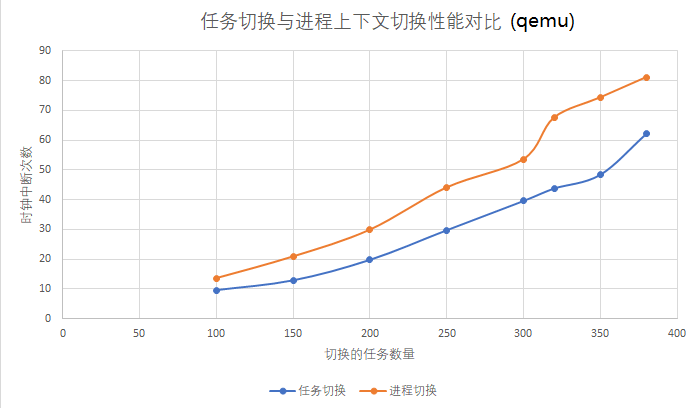
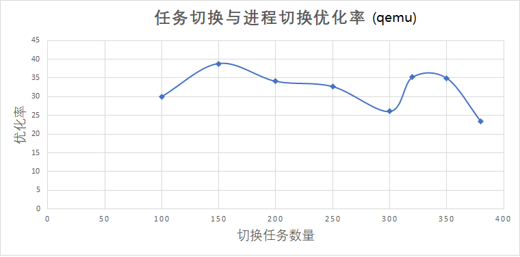
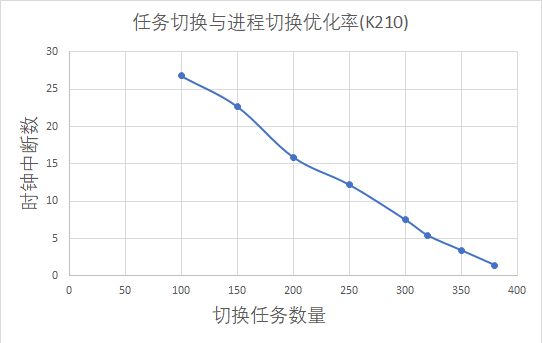

# 飓风内核性能测试之任务切换
通过对比实验测试飓风内核在上下文切换上的性能优越。

## 与飓风内核自身进行对照实验
本章节主要在飓风内核中协程的上下文切换和进程的上下文切换两者之间进行对比实验，大概思路是确保两者执行流除了上下文切换部分其他一致，运行一定数量的任务，
然后计算任务运行期间发生时钟中断的次数。

测试代码分别是：  
1. [analysis0.rs](../tornado-user/src/bin/analysis0.rs): 测试协程切换时间
2. [analysis1.rs](../tornado-user/src/bin/analysis1.rs)和[analysis2.rs](../tornado-user/src/bin/analysis2.rs): 测试进程切换时间

> 为了尽可能测出真实数据，第二组实验的执行器进行了一些修改，去掉了只在协程切换过程中必要的步骤。

采用时钟中断间隔为5000。

### qemu平台(版本5.2.90)
下面数据均采用10次重复实验求平均值，测量值为时钟中断次数。

|切换种类/任务数量|100|150|200|250|300|320|350|380|
|---|---|---|---|---|---|---|---|---|
|协程|9.5|12.8|19.7|29.7|39.6|43.8|48.4|62.2|
|进程|13.6|20.9|29.9|44.1|53.6|67.6|74.4|81.2|



  

### k210平台
下面数据均采用3次重复实验求平均值。(k210烧写太慢了，而k210下测出的数据比较稳定)

|切换种类/任务数量|100|150|200|250|300|320|350|380|
|---|---|---|---|---|---|---|---|---|
|协程|9.0|17.0|28.6|43.0|61.3|70.0|83|97.6|
|进程|12.3|22.0|34.0|49.0|66.3|74.0|86.0|99.0|



## 与rCore-Tutorial-v3进行对照实验
本章节主要是在飓风内核和`rCore-Tutorial-v3`之间进行关于`多任务切换`的对照实验，旨在探讨飓风内核中运行多任务与传统内核运行多任务之间的性能对比。

> note: 对比测试的 rCore-Tutorial-v3 commit: 940073e9f30b77698704a90c5e1e2837b87eb2b9

飓风内核中运行多任务的方式在[第三章-内核任务与内核执行器](./第三章-内核任务与内核执行器.md)中有详细讲到，测试代码是[analysis3](../tornado-user/src/bin/analysis3.rs)。

rCore-Tutorial-v3中用户运行多任务主要是通过`fork`系统调用，测试代码如下：  
```Rust
#![no_std]
#![no_main]
#[macro_use]
extern crate user_lib;
use user_lib::{fork, wait, exit, get_time};
const MAX_CHILD: usize = 100;
#[no_mangle]
pub fn main() -> i32 {
    let start = get_time();
    for i in 0..MAX_CHILD {
        let pid = fork();
        if pid == 0 {
            // println!("I am child {}", i);
            exit(0);
        } else {
            // println!("forked child pid = {}", pid);
        }
        assert!(pid > 0);
    }
    let mut exit_code: i32 = 0;
    for _ in 0..MAX_CHILD {
        if wait(&mut exit_code) <= 0 {
            panic!("wait stopped early");
        }
    }
    if wait(&mut exit_code) > 0 {
        panic!("wait got too many");
    }
    let end = get_time();
    println!("[analysis] rCore-Tutorial-v3 time {}", end - start);
    0
}
```

在实验中，严格保证飓风内核和rCore-Tutorial-v3的以下条件一致：  
* 时间计算方式一致
* qemu版本一致(5.2)
* 运行qemu的操作系统(Ubuntu虚拟机)
* 使用同一个k210硬件(Maix Dock)
* 均是从`main`函数开始计时，退出`main`函数之前结束计时。

## qemu平台
下面数据均采用5次重复实验求平均值，测量值为`get_time`系统调用返回值。

|内核种类/任务数量|50|100|150|200|250|300|
|---|---|---|---|---|---|---|
|飓风内核|13.2|14.0|26.4|43.8|59.4|83.8|
|rCore-Tutorial-v3|40.6|75.8|125.8|158.2|224.6|238.8|


## k210平台
下面数据均采用3次重复实验求平均值，测量值为`get_time`系统调用返回值。

> note: 在k210平台上由于内存资源有限，和rCore-Tutorial-v3的一些写法上的原因，任务数最多可以跑80个。


|内核种类/任务数量|10|20|30|40|50|60|70|80|
|---|---|---|---|---|---|---|---|---|
|飓风内核|1.0|1.0|2.0|3.0|4.0|5.7|7.0|8.0|
|rCore-Tutorial-v3|37.3|75.0|113.3|153.3|192|231.3|270.7|310.3|

