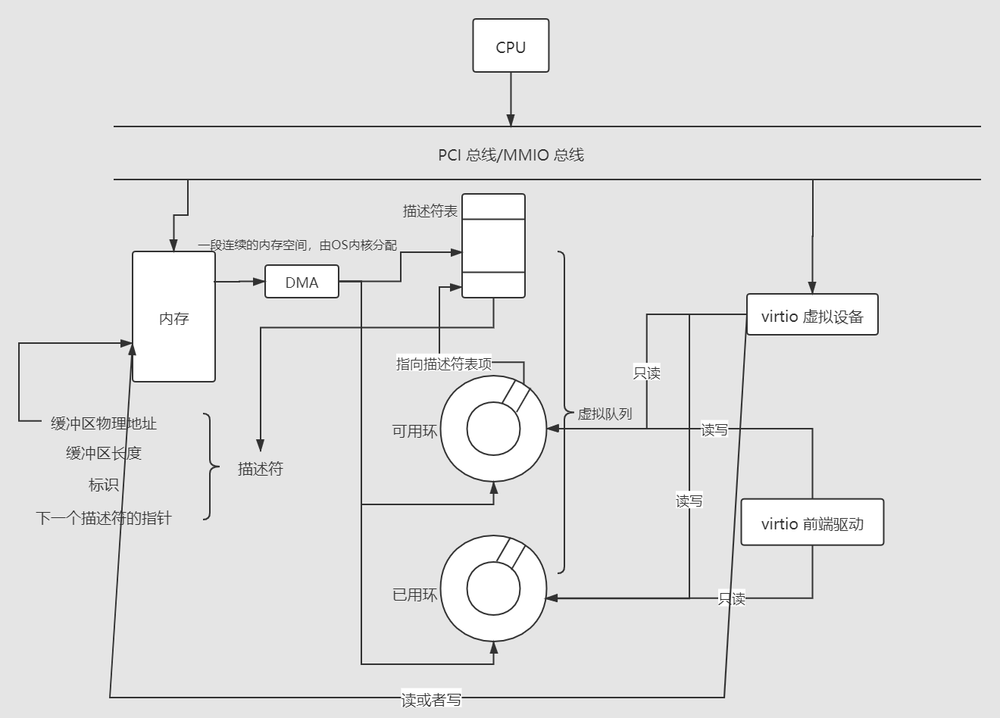

# virtio异步块设备驱动设计与实现
实现virtio异步块设备驱动，为飓风内核原生异步文件IO提供支持。

## virtio初探
首先我们来思考两个问题：  

1. 什么是 virtio
2. 为什么需要 virtio

第一个问题，virtio 是半虚拟化场景中的一个 IO 传输标准，它的标准文档可以在[这里](https://docs.oasis-open.org/virtio/virtio/v1.1/csprd01/virtio-v1.1-csprd01.html)找到。可以理解为半虚拟化场景中客户机和硬件资源之间的数据传输需要一些通用标准（或协议）来完成，virtio 就是这样一套标准。  
然后第二个问题，virtio 如上所述是一个标准，标准一般会有个作用就是提高兼容性，减少开发工作量。对于 virtio 来说，如果没有这个标准的话，那么开发者就需要为每个虚拟设备单独实现一个设备驱动，如果有 N 个虚拟设备，每个驱动程序的平均代码量是 M，那就需要开发者贡献 N x M 大小的代码量。但是如果有 virtio 标准的话，开发者就可以针对这个标准写一套框架（假设框架的代码量为 A），然后再基于这个框架去写每个虚拟设备的驱动程序（平均代码量为 M - A），这样一来总代码量就是 A + N x (M - A) = N x M - (N - 1) x A，因此在虚拟设备数量较多的情况下，该标准可以减少开发者们的工作量。  

virtio 架构大概可以分为三层：  
+ 操作系统中各种设备前端驱动
+ 中间层，数据传输的桥梁
+ 后端虚拟设备

> 网上很多博客会分四层，中间是 virtio 和 virtio-ring，但笔者写代码的时候没感受到中间分为两层的必要，因此这里分为三层，个人感觉这个区别不影响实现

设备前端驱动有块设备驱动(virtio_blk)，网卡驱动(virtio-net)等等，后端就是各种具体的硬件实现。笔者实现的是前端驱动部分。更多详细信息请查阅 rCore 教程第三版。

## virtio块设备架构
飓风内核目前实现的是各种虚拟设备驱动中的块设备驱动，下面是一张架构图，其中包含一些具体实现:  
  

> 下面的分析针对的场景是 virtio 设备是挂载在系统总线上，也就是 MMIO 方式的场景。对于其他 virtio 设备的呈现方式，比如挂在 PCI 总线上，由于笔者还没有深入研究，这里不作展开。  

其中`DMA`是一种内存与外设进行数据传输的手段，无需占用 CPU。操作系统内核分配一段连续的内存空间，用于存放`虚拟队列`，虚拟队列中包含三个部分，描述符表，可用环，还有已用环。  
可用环和已用环中的项指向描述符表中的表项，可用环是驱动程序修改，设备只读的，而已用环是设备修改，驱动程序只读的。驱动程序想要发起一个 IO 请求的时候，会创建一个`描述符链`，并将该链的头部描述符索引放到可用环中。设备完成一次 IO 请求后，会更新已用环。一次 IO 操作的具体流程请参考 rCore 教程第三版。  
描述符表中的表项是描述符，描述符的结构如以下代码所示：   
```Rust
#[repr(C, align(16))]
#[derive(Debug)]
pub struct Descriptor {
    /// buffer 的物理地址
    pub paddr: Volatile<u64>,
    /// buffer 的长度
    len: Volatile<u32>,
    /// 标识
    flags: Volatile<DescriptorFlags>,
    /// 下一个描述符的指针
    next: Volatile<u16>
}
```
注意这里的`paddr`是物理地址，因为虚拟设备会读取这里的地址和长度去直接操作内存中的数据，而这个操作是不经过 MMU，也就是不经过地址映射的，因此我们需要把缓冲区的物理地址而不是虚拟地址告诉虚拟设备。  

## 驱动异步化
下面介绍如何在rCore团队编写的virtio块设备驱动的基础上进行异步化。

### event-listener: 事件机制库
首先介绍一个在Rust异步编程中十分好用的开源项目：[event-listener](https://github.com/smol-rs/event-listener)。这个库本来不支持[no_std]模式，经过无相之风团队一番修改后可以在裸机环境里面使用了，请参考[event](../event/src/lib.rs)。

这个库的基础用法比较简单，一般是创建一个`Event`结构，然后注册一些监听者，使用`await`进行监听操作，最后调用`Event`的`notify`方法进行唤醒。
下面是一个例子：  
```Rust
let event = Event::new();

// 该消息被丢失因为没有监听者
event.notify(1);

// 创建三个监听者
let listener1 = event.listen();
let listener2 = event.listen();
let listener3 = event.listen();

// 通知两个监听者
//
// 通知机制遵循“先注册先通知”原则，这里通知`listener1`和`listener2`
event.notify(2);
```

### 异步化实现
有了`event`库，对块设备驱动进行异步改造代码上实现就比较简单了。

首先放出没有经过异步的同步代码：  
```Rust
pub struct VirtIOBlock<const N: usize> {
    /// 块设备的内部内容
    lock_inner: Arc<Mutex<VirtIOBlockInner>>,
    /// 不上锁的 inner，只读，用于中断处理的时候读取相应的状态
    ///
    /// todo: 不要通过 NonNull 所有权和生命周期机制，采用更加 Rust 的写法
    unlock_queue: NonNull<VirtQueue>,
    /// 容量
    #[allow(unused)]
    capacity: usize,
    /// 扇区大小
    pub sector_size: u32,
}
```

> ps: 这里常量泛型参数指代一个块中的扇区数。扇区是存储介质的最小存储单位，是物理上的概念；块是文件系统的最小存储单位，是逻辑上的概念。

```Rust
impl<const N: usize> VirtIOBlock<N> {
    pub fn read_sector(&self, block_id: usize, buf: &mut [u8]) -> Result<()> {
        // 缓冲区大小必须等于扇区大小
        if buf.len() != self.sector_size as usize {
            panic!(
                "[virtio] buffer size must equal to sector size - {}!",
                self.sector_size
            );
        }
        let req = BlockReq {
            type_: BlockReqType::In,
            reserved: 0,
            sector: block_id as u64,
        };
        let mut inner = self.lock_inner.lock();
        let mut resp = BlockResp::default();

        let (h, q) = inner.header_and_queue_mut();

        q.add_buf(&[req.as_buf()], &[buf, resp.as_buf_mut()])
            .expect("[virtio] virtual queue add buf error");

        h.notify(0);

        while !q.can_pop() {}
        q.pop_used()?;
        match resp.status {
            BlockRespStatus::Ok => Ok(()),
            _ => Err(VirtIOError::IOError),
        }
    }
}
```

异步化后的代码：  
```Rust
pub struct VirtIOBlock<const N: usize> {
    /// 块设备的内部内容
    lock_inner: Arc<Mutex<VirtIOBlockInner>>,
    /// 不上锁的 inner，只读，用于中断处理的时候读取相应的状态
    ///
    /// todo: 不要通过 NonNull 所有权和生命周期机制，采用更加 Rust 的写法
    unlock_queue: NonNull<VirtQueue>,
    /// 容量
    #[allow(unused)]
    capacity: usize,
    /// 扇区大小
    pub sector_size: u32,
    /// 添加一个[`Event`]成员后，实现异步化块设备驱动
    pub wake_ops: Event,
}

impl<const N: usize> VirtIOBlock<N> {
    pub async fn read_sector_event(&self, sector_id: usize, buf: &mut [u8]) -> Result<()> {
        let listener = self.wake_ops.listen();
        // 缓冲区大小必须等于扇区大小
        if buf.len() != self.sector_size as usize {
            panic!(
                "[virtio] buffer size must equal to sector size - {}!",
                self.sector_size
            );
        }
        let req = BlockReq {
            type_: BlockReqType::In,
            reserved: 0,
            sector: sector_id as u64,
        };
        let mut inner = self.lock_inner.lock();
        let mut resp = BlockResp::default();

        let (h, q) = inner.header_and_queue_mut();

        q.add_buf(&[req.as_buf()], &[buf, resp.as_buf_mut()])
            .expect("[virtio] virtual queue add buf error");

        h.notify(0);

        // 这里对事件进行监听，直接返回`Pending`,
        //
        // 只有`self.wake_ops`调用`notify`方法的时候才能回到这里执行。
        listener.await;

        q.pop_used()?;

        match resp.status {
            BlockRespStatus::Ok => Ok(()),
            _ => Err(VirtIOError::IOError),
        }
    }
}
```

可以看到仅仅在结构体中添加一个类型为`Event`的成员和在方法中添加监听操作，就可完成对块设备驱动的异步化。

在异步块设备驱动的语境下，操作系统内核应当在收到virtio外部中断的时候调用`wake_ops`的`notify`方法来唤醒相关的块设备读写任务。

## 异步块设备驱动使用
内核使用virtio异步块设备驱动的正确姿势：  
```Rust
/// 异步虚拟块设备接口
///
/// note: [`VirtIOBlock`]中的常量泛型参数指代一个块中有多少个扇区，
/// 这里目前假定为一个块对应一个扇区
pub struct VirtIOAsyncBlock(pub VirtIOBlock<1>);
impl VirtIOAsyncBlock {
    /// 创建一个[`VirtIOAsyncBlock`]
    pub fn new() -> Self {
        let header = unsafe { &mut *(VIRTIO0 as *mut VirtIOHeader) };
        let blk = VirtIOBlock::new(header).unwrap();
        Self(blk)
    }
    /// 从virtio块设备中读取一个块
    pub async fn read_block(&self, block_id: usize, buf: &mut [u8]) {
        self.0
            .read_block_event(block_id, buf)
            .await
            .expect("read block with event");
    }
    /// 往virtio块设备中写入一个块
    pub async fn write_block(&self, block_id: usize, buf: &[u8]) {
        // self.0.async_write_block(block_id, buf).await.expect("failed to write block from async_virtio_block!");
        self.0
            .write_block_event(block_id, buf)
            .await
            .expect("write block with event");
    }
    /// 处理virtio外部中断，通常在外部中断处理函数里面使用
    pub unsafe fn handle_interrupt(&self) -> Option<u64> {
        let ret = self
            .0
            .handle_interrupt()
            .expect("handle virtio interrupt error!");
        match ret {
            InterruptRet::Read(sector) => {
                return Some(sector);
            }
            InterruptRet::Write(sector) => {
                return Some(sector);
            }
            _other => {
                return None;
            }
        }
    }
}

/// 创建一个全局变量
lazy_static! {
    pub static ref VIRTIO_BLOCK: Arc<VirtIOAsyncBlock> = Arc::new(VirtIOAsyncBlock::new());
}

/// S态外部中断处理函数
///
/// note: 目前只处理virtio中断
pub unsafe extern "C" fn rust_supervisor_external(trap_frame: &mut TrapFrame) -> *mut TrapFrame {
    let irq = plic::plic_claim();
    if irq == 1 {
        // virtio 外部中断
        // 获得数据传输完成的块号
        let _intr_ret = VIRTIO_BLOCK
            .handle_interrupt()
            .expect("virtio handle interrupt error!");
        // **唤醒相应的块设备读写任务**
        crate::virtio::VIRTIO_BLOCK.0.wake_ops.notify(1);
        // 通知 PLIC 外部中断已经处理完
        crate::plic::plic_complete(irq);
        trap_frame
    } else {
        panic!("unknown S mode external interrupt! irq: {}", irq);
    }
}
```