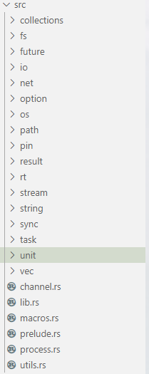
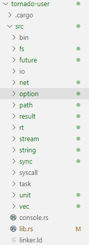

# 飓风内核的上层应用兼容性设计
使用飓风内核替代`async-std`，`tokio`等用户态Rust异步运行时库，从操作系统内核层面提供异步运行时。

## 一种应用场景
无相之风团队在开发异步操作系统内核的过程中一直在想一个问题：异步内核在工业环境下的应用场景在哪？替代Linux？替代一些当前主流的嵌入式操作系统？

Linux在经过多年的更新迭代，在行业中的地位已经根深蒂固，替代之说无从谈起。

替代一些当前主流的嵌入式操作系统貌似是一种可行方案，但目前嵌入式行业大部分从业者使用C语言进行开发，飓风内核目前来说比较难做到兼容C用户程序。

我们目前想到一种比较可行的应用场景就是，把飓风内核打造成一个对标`async-std`和`tokio`的内核异步运行时。

## 什么是异步运行时？
首先来理解下异步运行时的概念。

运行时，可以理解为“支撑程序运行的底层环境”。现代的各种编程语言都有运行时的概念，比如Java，有Java虚拟机提供的运行时环境，Go等编程语言也有自己的运行时。

异步运行时，就可以立即为“支撑异步代码运行的底层环境”，在Rust中，异步代码特指带有`async/await`关键字的函数或闭包或代码块。

## 原理
Rust里面异步编程模型围绕着`Future`这个核心概念，标准库子库`core`提供`Future` trait，第三方库提供异步运行时。这样以来，我们的异步操作系统内核不也可以是一个第三方库，提供异步运行时吗？

事实上无相之风团队在编写异步内核的时候就感觉和在写一个异步运行时非常相似，有很多概念上的相似性。

## 可行性
这里我们想让大家看一下`async-std`的目录结构：  
  

然后再看一下飓风内核用户程序的目录结构:  
  

是不是有非常高的相似度？

目前我们有一个想法就是，在飓风内核里面实现`async-std`或`tokio`中的大部分或者全部接口，这样一来，现有的一些基于`async-std`还有`tokio`异步运行时的应用程序
就可以很容易地移植到飓风内核上面来，实现上层应用兼容性设计。

回到之前关于异步内核应用场景的讨论，我们目前觉得想要让异步内核兼容现在的所有应用程序，是不太现实的，不妨把支持目标范围缩小一点，先支持**现在大部分基于`async-std`或者`tokio`的Rust应用程序**，是不是可行性高一些？

目前看来可行性是比较高的，分析如下：  
1. 无论是`async-std`还是`tokio`，它们提供的接口分为两种：一种是与平台相关，也就是操作系统/指令集相关的；另一种是只与编程语言/逻辑相关的。
2. 对于上述的第二种接口，我们可以直接移植到飓风内核(不排除需要一点努力)，实现比较快捷。
3. 对于平台相关的接口，就需要我们的异步操作系统提供相关的系统调用支持，比如异步文件IO，异步网络IO。这部分是需要我们花精力去实现的。
4. 对于3，这部分其实在原理上是“工作量模块”，意思是说这部分在原理上没有太大的创新点，只需要花时间和精力就能实现。
5. 最重要也就是最重要的内核异步运行时部分，无相之风团队已经基于共享调度器的思想实现了比较完整的一版。

总结：对于飓风内核将来只需要完成异步网络驱动的搭建，完善相关系统调用，原理上就可以实现`async-std`或`tokio`中的大部分接口。

然后就可以移植一些现有的基于`async-std`或`tokio`的一些用户应用程序到飓风内核上了，这就是飓风内核也可以说是异步内核的一种应用场景。

