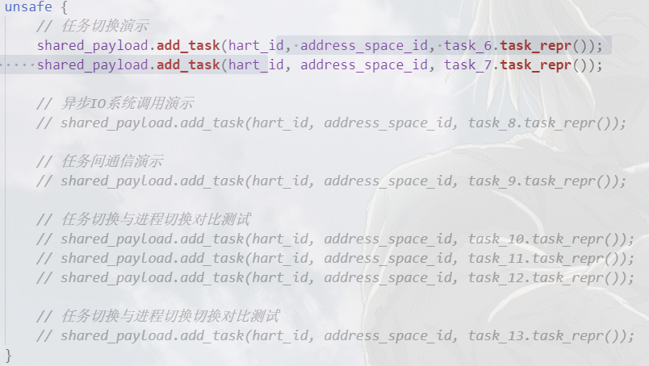

# 飓风内核用户态程序演示说明

## 如何选择演示程序运行
  

注释/取消注释上图的相应代码块即可，比如像运行`任务切换演示程序`，取消前面两行的注释，将其他代码注释掉，然后使用`cargo qemu`运行就可以了。

## 任务切换演示程序
  

## 异步IO系统调用演示程序
  

## 任务间通信演示程序
  

## 任务与进程上下文切换对比性能测试程序
  

## 任务与线程上下文切换对比性能测试程序

## 数据库演示程序