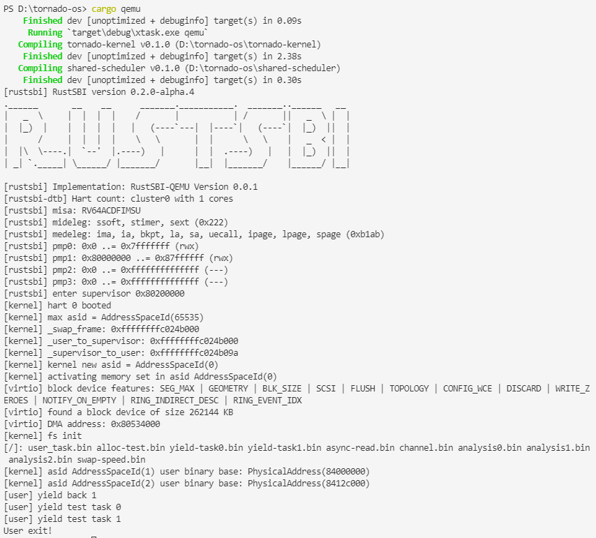
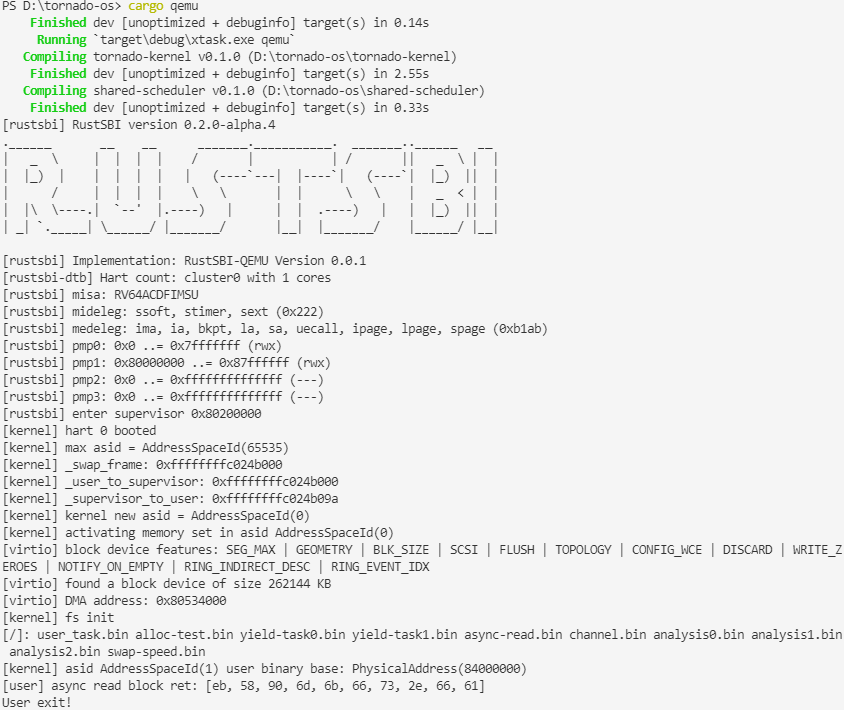
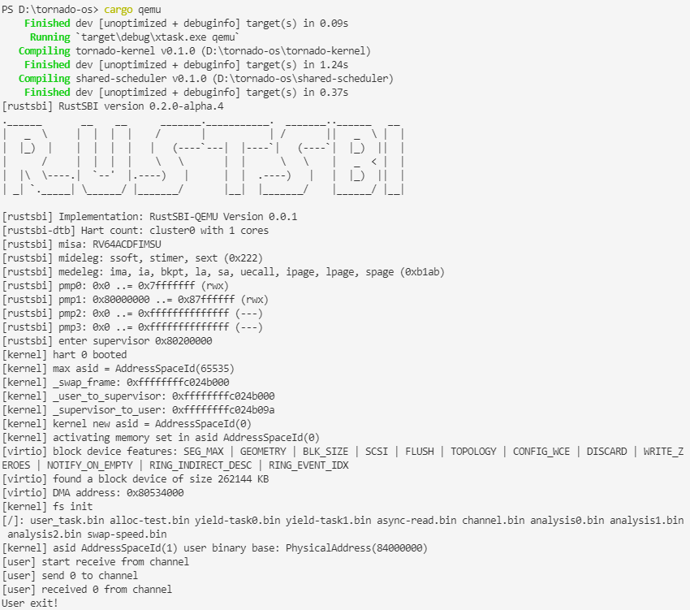
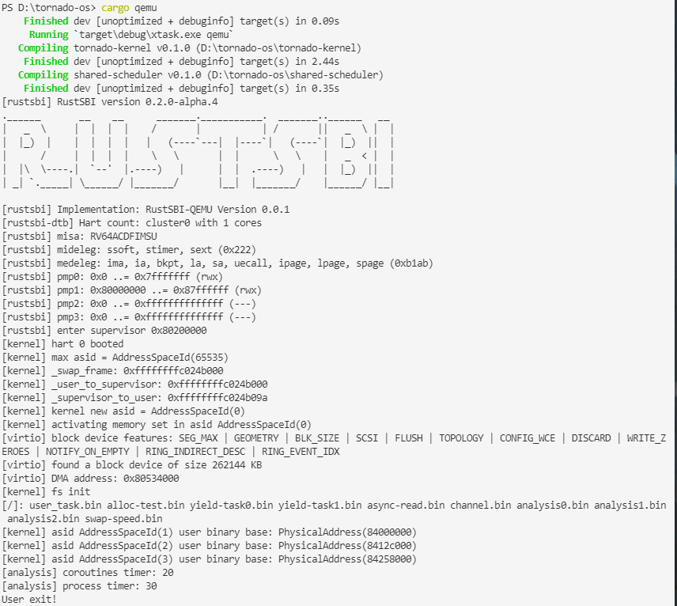

# 飓风内核用户态程序演示说明

## 如何选择演示程序运行
打开[tornado-kernel/src/main.rs](../tornado-kernel/src/main.rs)文件，找到下面代码部分：  
```Rust
unsafe {
        // 任务切换演示
        shared_payload.add_task(hart_id, address_space_id, task_6.task_repr());
        shared_payload.add_task(hart_id, address_space_id, task_7.task_repr());

        // 异步IO系统调用演示
        // shared_payload.add_task(hart_id, address_space_id, task_8.task_repr());

        // 任务间通信演示
        // shared_payload.add_task(hart_id, address_space_id, task_9.task_repr());

        // 飓风内核自身对照实验
        // shared_payload.add_task(hart_id, address_space_id, task_10.task_repr());
        // shared_payload.add_task(hart_id, address_space_id, task_11.task_repr());
        // shared_payload.add_task(hart_id, address_space_id, task_12.task_repr());

        // 飓风内核与rCore-Tutorial-v3对照实验
        // shared_payload.add_task(hart_id, address_space_id, task_13.task_repr());

        // 数据库程序演示
        // shared_payload.add_task(hart_id, address_space_id, task_14.task_repr());
    }
```

注释/取消注释上图的相应代码块即可，比如像运行`任务切换演示程序`，取消前面两行的注释，将其他代码注释掉，然后使用`cargo qemu`运行就可以了。

## 任务切换演示程序

<!--    -->

该演示程序主要演示了怎么进行不同地址空间的任务的切换，首先地址空间1的用户程序往共享调度器里面添加了一个任务，然后通过`yield`系统调用切换到地址空间2，地址空间2的用户程序也往共享调度器里面添加了一个任务，然后运行执行器，发现从共享调度器里面拿出来的任务是在地址空间1，于是通过`yield`系统调用切换到地址空间1中运行，这时候地址空间1的用户程序打印出`yield back 1`，表示重新回到自己的执行流，然后运行执行器，运行完一个任务之后(该任务打印"[user] yield test task0")，发现下一个任务是在地址空间2的，于是又通过`yield`系统调用切换到地址空间2中运行，这时候地址空间2的用户程序继续运行执行器，拿出一个任务运行(该任务打印"[user] yield test task1")之后，发现共享调度器中没有任务了，于是系统退出。

## 异步IO系统调用演示程序

<!--    -->

该演示程序主要演示了怎么通过异步IO系统调用从块设备中读取块，这里读取了块号为0的块，打印前10个字节，结果显示正好是FAT32文件系统的头部。

异步IO系统调用的实现原理请参考[第七章-异步IO系统调用](./第七章-异步IO系统调用.md)。

## 任务间通信演示程序

<!--    -->

该演示程序主要演示了怎么进行任务间通信，这里主要通过通道(channel)进行通信，先通过`bounded`函数获得一个发送者(`Sender`)和一个接收者(`Receiver`)，然后利用`Arc`智能指针让它们在任务间共享，发送方可以通过`send`方法发送消息，接收方可以通过`receive`接受消息。

如果接收方调用`receive`方法的时候通道缓冲区为空，则返回`Pending`，同理，发送方调用`send`方法的时候通道缓冲区已满，则返回`Pending`。这就是该演示程序结果中输出`start receive from channel`和`receive 0 from channel`中间掺杂输出`send 0 to channel`的原因。

## 飓风内核自身对照实验性能测试程序

<!--    -->

具体请参考[第九章-性能测试](./第九章-性能测试.md)。

## 飓风内核与rCore-Tutorial-v3对照实验测试程序
结果和`飓风内核自身对照实验性能测试程序`基本一致。

具体请参考[第九章-性能测试](./第九章-性能测试.md)。

## 数据库演示程序