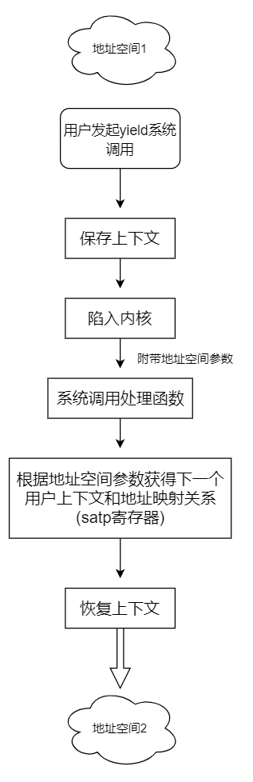

# 用户执行器与yield系统调用
飓风内核在用户态通过用户执行器执行任务，并通过`yield`系统调用来切换地址空间。

## 用户态任务
用户态任务目前和内核态任务设计没有太大区别，详细请参考[第三章-内核任务与内核执行器](./第三章-内核任务与内核执行器.md)。

## 用户执行器
用户执行器目前的设计和内核执行器只有一点区别，那就是拿到不在当前地址空间的任务的时候，采取的处理措施不同。


在[第一章-飓风内核设计](./第一章-飓风内核设计.md)中讲到，当执行器从共享调度器中返回的内容是应当切换地址空间的时候，需要切换到目的地址空间去运行任务。在用户执行器中这时候需要执行`yield`系统调用。

yield系统调用的作用是：保存当前用户上下文，陷入内核，恢复下一个用户的上下文。

执行`yield`系统调用后如果前一个地址空间在将来成为切换目标时，将会从上下文保存处继续运行用户程序。

伪代码大概是这样：  
```Rust
pub fn run_until_ready() {
    loop {
        let task = peek_task(); // 从共享调度器中获取任务
        match task {
            TaskResult::Task(task_repr) => {
                let task: Arc<UserTask> = unsafe { Arc::from_raw(task_repr as *mut _) };
                let waker = waker_ref(&task);
                let mut context = Context::from_waker(&*waker);
                let ret = task.future.lock().as_mut().poll(&mut context);
                if let Poll::Pending = ret {
                    set_task_state(task_repr, TaskState::Sleeping); // 设置任务状态为睡眠
                    core::mem::forget(task);
                } else {
                    delete_task(task_repr); // 删除任务
                }
            },
            TaskResult::ShouldYield(next_asid) => {
                // 不释放这个任务的内存，执行切换地址空间的系统调用
                mem::forget(task);
                do_yield(next_asid);
            },
            TaskResult::NoWakeTask => {},
            TaskResult::Finished => break;
        }
    }
}
```
## yield系统调用实现原理
要实现yield系统调用，我们的系统需要知道3样东西：  
1. 目的地址空间编号
2. 目的地址空间的用户上下文
3. 目的地址空间的地址映射关系

目的地址空间编号共享调度器会给出。

所有用户上下文都存放在`跳板页`数据段中，每个用户上下文的起始虚拟地址可以通过下面的方法计算出来：  
```Rust
/// 根据用户的地址空间编号返回上下文起始虚拟地址
const fn user_contex_va(asid: usize) -> usize {
    usize::MAX + 1 - PAGE_SIZE * (asid + 1)
}
```

每个用户有一页的内存空间来保存上下文。通过上面这个函数就可以根据地址空间编号获得用户上下文的虚拟起始地址了。

但是这时候还不能获得用户上下文，因为我们还不知道该用户的地址映射关系。因此我们在需要在内核态里面通过某种方法保存每个用户的地址映射，
以便于用户陷入内核的时候内核可以访问用户地址空间。

飓风内核里面采用的方法是：利用`tp`寄存器，在内核里面它会指向一个地址，这个地址上保存着一个与处理核相关的数据结构`KernelHartInfo`，
用户的地址空间映射就保存在这个结构里，具体请参考[hart.rs](../tornado-kernel/src/hart.rs)。

> ps: RISC-V指令集中tp寄存器指代`thread pointer`，和硬件线程有一点关系，(据说)编译器一般会把线程的上下文基地址放这里来索引一些线程上下文里面的变量。

有了上面三个要素，yield系统调用的流程就如下图所示:  

<!--    -->

