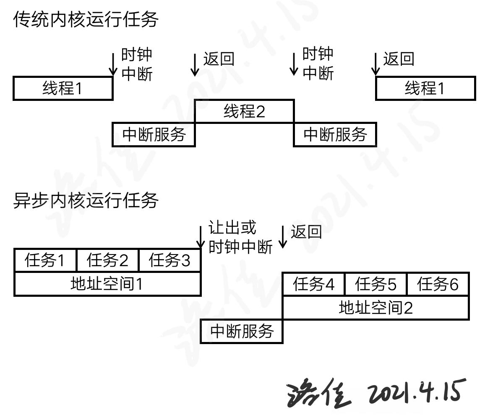

# 异步内核的设计与实现

操作系统内核经历了几个主要的发展阶段，从裸机应用、批处理系统到多道任务系统，演变为至今主流的线程操作系统。这种系统基于线程的切换来调度任务；为了提升它的性能，有一些语言和编程架构，在应用层复用线程资源，提出了“协程”的概念，节省任务调度的开销。本次的作品中我们提出一个新的思想：由不同资源共享调度器，在操作系统层面提供协程。我们期望通过这种全新设计的内核，同时满足传统操作系统的易用性，和专有操作系统的高性能特点。

## 1 内核中的调度对象

异步内核是为处理任务而设计的。传统基于线程的编程方法中，线程会较长期地存在于系统内；较新型的编程语言中，协程通常是较短的任务片段，通常不会常驻在运行环境里。本次的内核设计中，我们将这两类时间资源的组织形式统称为“任务”。较短或较长的时间资源，都作为任务，统一被调度器处理和分配。

任务的优先级、状态和表示方式称为任务的元数据，它是由用户级和系统级共享的资源。调度器根据元数据，决定下一个阶段应当运行的任务。由任务的表示方式可以得到内容，但因为不同的上下文具有不同的地址空间，不同地址空间不能相互访问资源，从而任务的内容只有它所属的地址空间可以解释。

根据任务所占空间资源的不同，每个任务将粗略的分属于一个地址空间。这个地址空间意味着他们共享同一组资源或映射方式，同一空间内的任务相互切换开销较小；不同空间内的任务相互切换，就有较大的开销。任务所属的地址空间将被标记在它的元数据中，以便调度器解释和运算，尽量运行同一空间的任务。

## 2 如何运行异步任务

传统内核中，线程的执行占用整个处理核的计算资源。因此，通常的指令集架构都允许介入当前环境而切换上下文，这些介入方式通常与时间有关，我们称之为时钟中断。这种较为强制性方式没有过多的前提条件，因此通常假定所有影响的部分都需要保存，因此这类抢占式调度为主的方式保存上下文时间较长。

在异步内核中，协作式调度占主要的地位。我们假定切换地址空间的开销较大，就需要更多的任务在同一个地址空间里完成。调度器将优先处理同地址空间的任务，因为这能减少切换地址空间的次数。在运行多个任务后，我们提供主动让出的方式。主动让出执行后，将陷入内核，分配下一个空间的任务并运行。

主动让出和传统内核的中断有哪些关联呢？我们的主动让出，通常在已知晓任务执行完成的情况下。当任务执行完成，它占有的资源也将被释放，所以此时主动让出处理核资源，不需要保存上下文。相似地，恢复到下一个任务时，通常这个任务才开始运行，它没有需要恢复的处理核资源，若不考虑安全性，此时不需要恢复上下文。在传统的中断中，保存、恢复上下文总是必要的过程。

现代编程语言的异步任务通常较短，它的长度小于一个时间片，最终将会执行让出操作。如果有意编写较长的异步任务，我们就可将时钟中断作为一种“保底机制”，此时一个强制的中断，阻止它继续占用处理核时间。时钟中断没有过多的前提，此时需要保存任务的上下文，下次也需要恢复此上下文。

异步任务拥有不同的执行逻辑，它的调度器也需要特殊设计。调度器常给出相同空间的任务，因此不会频繁地让出，从而保证切换的次数较少，开销较低。

## 3 共享调度器

以往的操作系统内核中，调度器只在内核中运行。内核中执行不同的线程，这些线程中的任务完全由用户的任务给定，而不涉及调度运行的逻辑。如果我们开始设计异步内核，在用户层也要完成任务到任务间的切换过程。这种切换是以知晓下一个任务为前提的，所以用户层也需要运行一个调度器。我们可以以两种思路设计这种调度器：

——共享参数的分离调度器。类似于许多共享内存的输入-输出接口，它们以一些共享内存中的信息作为媒介，和内核交流。用户层的调度器以此和内核沟通，从而判断下一个任务是哪一类任务。

——合并的共享调度器。这种调度器直接将所使用的代码、任务池资源都共享到用户，由用户运行和内核相同的代码，以此与内核以相同的逻辑处理任务池中的任务，从而从共享的任务池中得到下一个任务。

共享参数调度器的设计要求无论信息为何，用户都不能干扰内核的运行，因此具有一定的安全性。这种设计需要一个工程学上稳定的数据接口，才能在内核、应用更新之后，仍然能够和旧的应用共存调度，完成内核的功能。合并的共享调度器要求将代码、任务池数据都共享给用户，在传统的架构上具有一定的风险，但用户运行的代码永远和内核是同一个版本，有利于生态的建设和推广。

社区中已有rCore-OS团队的aCore作为共享参数调度器的参考。本次设计中，我们采用合并的共享调度器，以探索未来操作系统内核的可能性，希望以此促进指令集架构的研究和探讨，帮助设计更安全的指令集架构。

共享调度器的实现可以采用页表的多重映射，在没有页表系统的嵌入式核上，也可以通过在内存权限寄存器中设计交集来实现。

## 4 调度器与执行器

在上面的分析中，我们已经知道了，异步内核中需要一个合适的调度器，它也能够用户层运行，来完成调度任务的目的。这个调度器返回的内容应当分为以下三类：一、执行一个特定的任务；二、应当切换空间，以执行下一空间的任务；三、任务池为空，应当退出程序。

这就是为什么我们需要执行器。调度器因为要设计得便于在地址空间间共享，它执行任务的逻辑就应当独立为一个执行器。这个执行器也由用户设计，它将调用本空间内共享的调度器，根据调度器输出的结果，执行对应的任务。

执行器应当根据调度器的输出来处理。如果存在不合规则的用户，不按调度器的输出执行操作，对内核的运行没有较大的影响。我们分为两类情况讨论这个问题。如果应当执行任务，却切换了地址空间，用户层将得不到继续运行所属任务的时间，因此这个操作将导致异步程序无法运行，容易被用户发现和修复。如果应当切换空间，执行器却继续执行特定的任务，“保底机制”时间中断就出现了，超时中断当前的程序，以免占据处理核时间资源。

另外，由于任务池中包含任务的元数据，只有当前地址空间的任务，允许在当前地址空间运行。因为任务的元数据中包含它的内容，只有当前地址空间的执行器可以解释，所以夹杂不同空间的调度器，不会造成执行器误认任务的情况。

在真实的应用开发中，用户不会选择为每个程序都编写一个执行器。因此，编程语言将提供简单的执行器，与用户的程序共同编译，得到完整的异步程序。

## 5 向调度器添加任务

我们有了共享的调度器，就应当新建一个任务，添加到调度器中了。由于调度算法将共享到用户层，添加任务的方法也应当共享到用户层。用户层添加新任务时，直接在当前地址空间分配、新建任务的信息，拿到一个当前空间能识别的数据作为任务的内容，从而以此作为识别任务的标志，加入到调度器中。

删除任务或任务执行完毕时，这个标志将可在地址空间内被还原为任务，从而生命周期被还原，就可以释放任务占用的内存资源。将要执行此任务时，可以通过标志得到任务的引用，从而拿出任务的内容开始执行。

这个添加任务的过程也是异步编程最核心的“生成”原语。异步编程中，常常生成一个新的任务，来分担本任务的工作，或者作为本任务结束后，接受返回数据并处理的后续任务。通过向共享调度器添加任务，我们或用语法，或用标准库函数的形式，最终可以将封装好的“生成”原语提供给用户。

## 6 进程与地址空间

我们提到了地址空间的概念，它是内存资源映射和分配必需的因素。我们仍然需要考虑内核中空间资源的分配，传统内核中“进程”的概念可以被再次利用。

开发包含插件的应用时，以往的内核将插件以链接库的形式加入主程序的进程，以便和主程序共享资源。然而在考虑安全性的前提下，主程序占有的所有资源并非都希望对插件可见，链接库形式的插件在主程序的同一个进程中，就不得不拥有这些资源的所有权，这将带来很多安全性问题。

所以我们在同一个地址空间下，可以设计多个进程，每个这些进程因为在同一个地址空间，可以很方便地通信。又因为不同的进程占用不同的资源，主程序和插件程序的权限隔离就终于可以达成了。

在实际的应用中，插件系统的主程序将通过专门的系统调用，得到当前的地址空间编号，用这个编号新建一个插件子进程，这样子进程就被映射到同一空间里了。插件和主程序在两个进程中，因此互不共享资源，从而保证了安全性。

## 7 内核本身的异步设计

通过以上的步骤，我们拥有了一个可以运行异步任务的完整运行时，和一个即将添加更多代码的内核。我们可以用这个运行时，编写异步代码的文件系统、网络层协议以及更多的内容。内核本身运行的速度也受益于本身提供的运行时，这样异步内核的设计也允许内核开发者发挥想象力，将异步编程运用到内核开发的更多个方面上来。内核中常见的文件、设备等概念也可以由此产生了。
